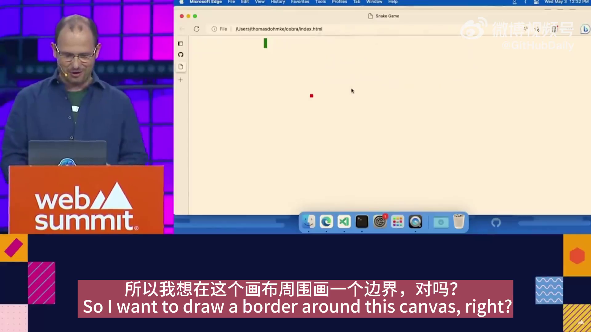
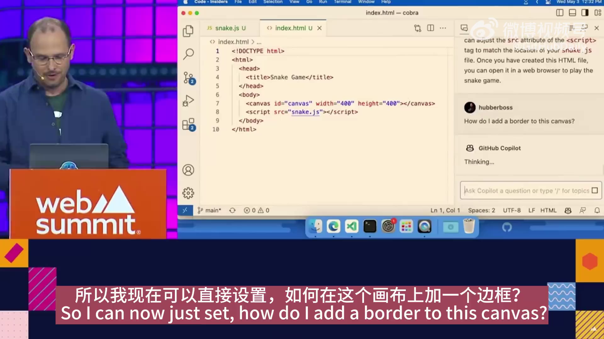
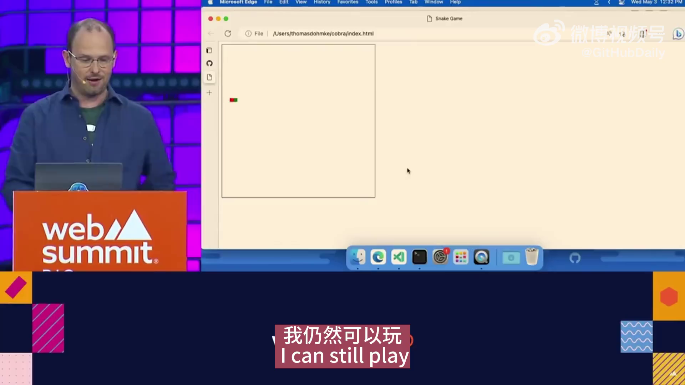
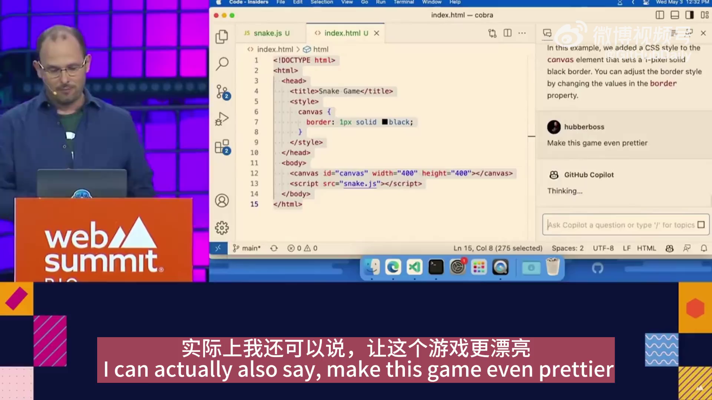
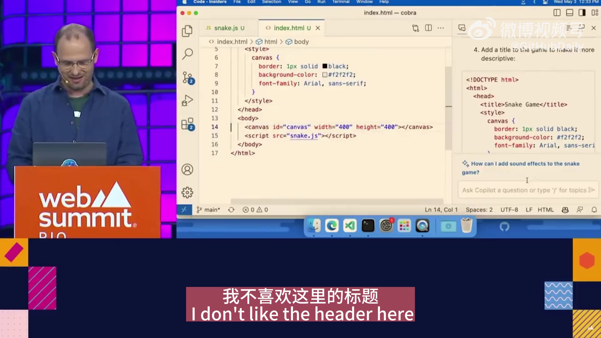

# 优化游戏画布：一步步提升用户体验

在这篇文章中，我将分享我是如何一步步改进这个游戏画布的外观，并最终让游戏更加引人入胜的。

## 添加边框

首先，我想给这个画布加一个边框对吧？于是，我考虑如何为这个画布添加一个边框。



通过咨询，我得到了一个新代码，并了解到我需要用CSS设置一个1像素的边框。这非常简单，我只需要将代码复制粘贴到新文件中。

```css
canvas {
  border: 1px solid black;
}
```



回来看看效果，现在我的游戏画布有了一个边框。我依然可以继续玩游戏，并且当我撞到边框时，得分会增加1分。



## 美化画面

其实，我还可以让这个游戏画面变得更漂亮。系统提供了几个选项供我选择，例如设置背景颜色、修改JavaScript代码等等。我选择了一些代码并将它们粘贴到相应的位置。

```css
canvas {
  border: 1px solid black;
  background-color: #f2f2f2;
  font-family: Arial, sans-serif;
}
```



让我们来看一下效果，嗯，确实有一点改进，但是我不太喜欢现在的标题样式。下一步，我想让画布居中显示，这是一项经常让程序员头疼的问题。

## 居中显示画布

对于许多人来说，在HTML页面中居中一个div（准确来说是canvas）是编程中最困难的问题之一。好在，有了Copilot的帮助，这个问题迎刃而解。

```css
body {
  display: flex;
  justify-content: center;
  align-items: center;
  height: 100vh;
  margin: 0;
}
```

我将所有的代码集中在一起，让画布居中显示，现在我的游戏画布终于居中了！



## 总结

通过这些步骤，我不仅为游戏画布添加了边框，还优化了外观，提升了用户体验。这段改进过程展示了如何简单地使用CSS和JavaScript来改善网页元素，并通过有效工具提高工作效率。希望这些经验能对你有所帮助，也希望你能享受这个优化后的游戏体验。
